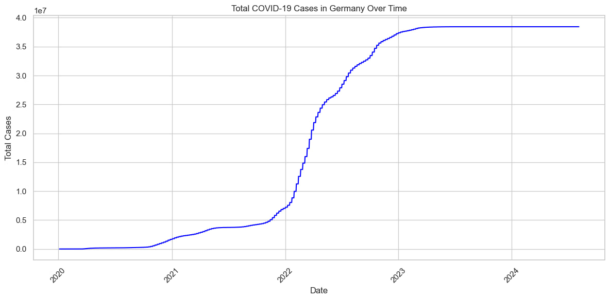
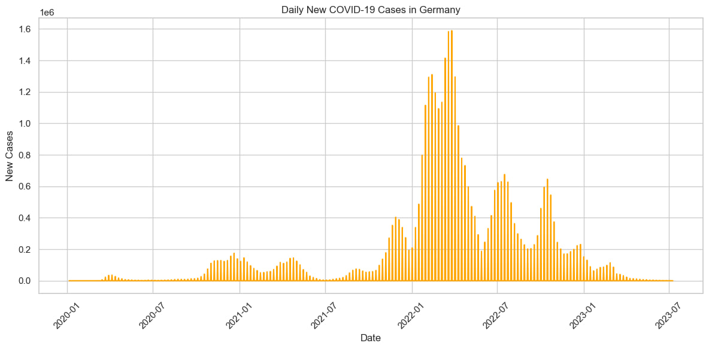
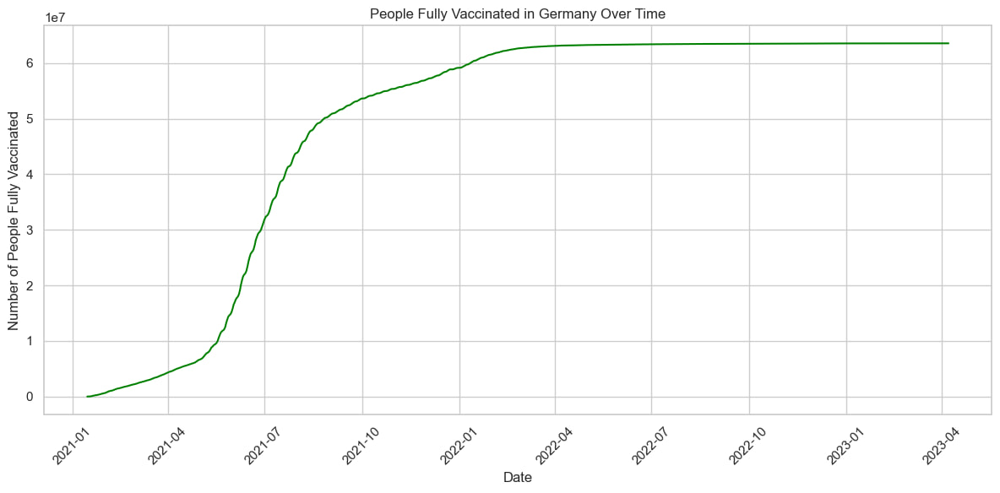
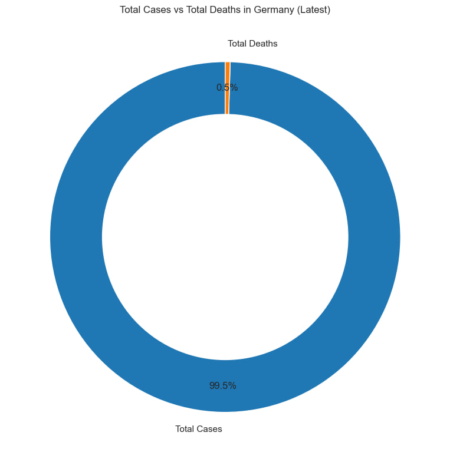
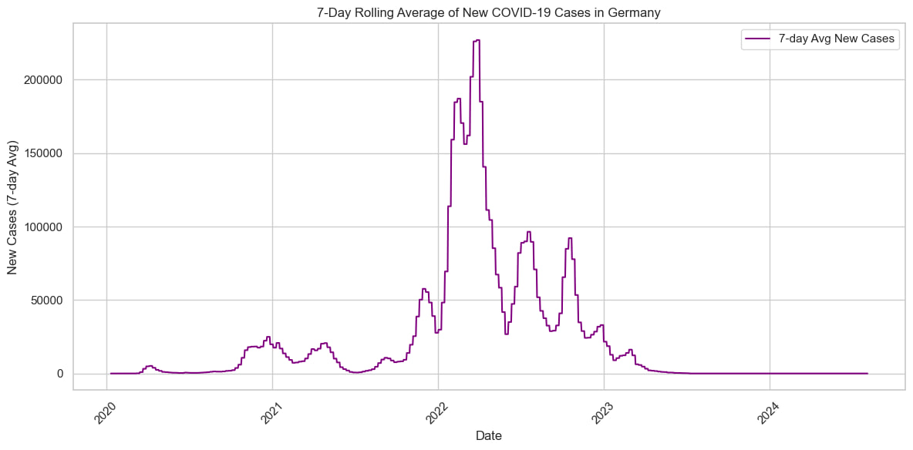
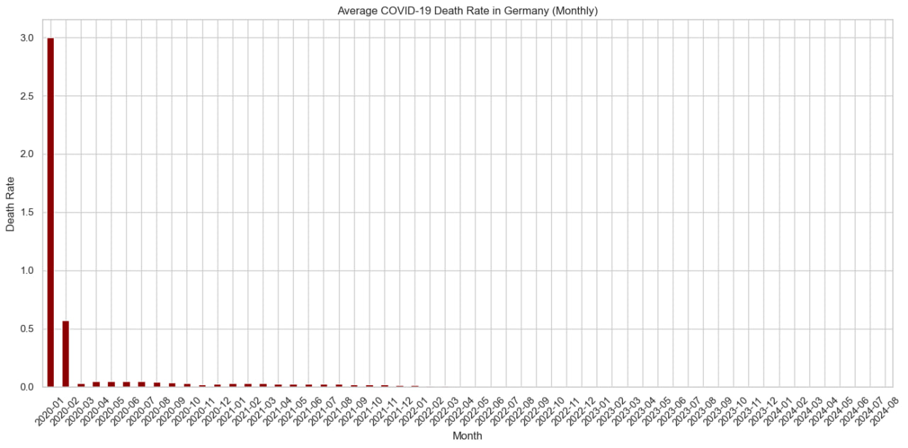
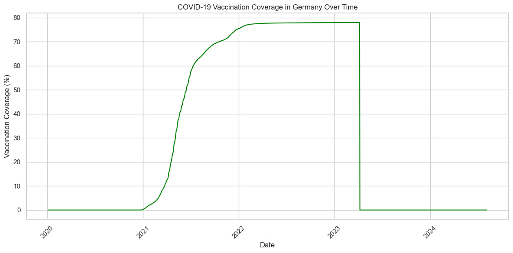

# COVID-19 Analysis: Germany

This project focuses on analyzing COVID-19 data specific to Germany, using a dataset from Our World in Data. The goal was to explore trends in cases, deaths, and vaccinations through data cleaning, transformation, and visualization.

## Project Overview

The analysis includes:

- Cleaning and filtering a large dataset for Germany
- Handling missing values using forward fill techniques
- Converting date formats and selecting relevant columns
- Creating new columns such as:
  - Active cases (total cases - total deaths)
  - 7-day rolling average of new cases
  - Vaccination coverage as a percentage of the population

## Data Source

The data was taken from 'Our World in Data' ([https://ourworldindata.org/covid-deaths](https://ourworldindata.org/covid-deaths)) and saved locally as `covid-data.csv`.

## Tools and Libraries

- Python
- Pandas
- NumPy
- Matplotlib
- Seaborn
- Plotly

## Visualizations

The project includes several types of visualizations to make the trends easier to understand:

- Line plots showing daily and total COVID cases over time
- Bar charts for new deaths and rolling averages
- Donut and pie charts to represent vaccination status

---

##  Project Visualizations

### 1. Total COVID-19 Cases in Germany Over Time  
Shows the progression of total cases reported in Germany throughout the pandemic.  

---

### 2. Daily New COVID-19 Cases in Germany  
Highlights the daily number of new reported cases, with visible waves and peaks.  

---

### 3. People Fully Vaccinated in Germany Over Time  
Insights of number of people getting fully vaccinated over time.  

---

### 4. Total Cases vs Total Deaths in Germany (Latest)  
A donut chart comparing the proportion of total cases to total deaths in the latest available data.  

---

### 5. 7-Day Rolling Average of New COVID-19 Cases in Germany  
A line plot displaying the number of new cases in each 7-day period across the pandemic timeline.  

---

### 6. Average COVID-19 Death Rate in Germany  
Demonstrates the number of monthly average deaths throughout the country.  

---

### 7. COVID-19 Vaccination Coverage in Germany Over Time  
Shows the percentage of Germany's population covered by at least one vaccine dose over time.  

---

## Skills Demonstrated

- Data cleaning and transformation
- Exploratory data analysis (EDA)
- Data visualization with multiple libraries
- Feature engineering to add real-world insights
- Writing clean, well-commented Python code

---

##  What I Learned

Through this project, I gained hands-on experience with:

- Data cleaning and preprocessing using **Pandas**
- Time-series analysis and plotting with **Matplotlib** and **Seaborn**
- Real-world data insights through visualization
- Structuring a data analysis project for GitHub and portfolio presentation
- Version control using **Git** and publishing via **GitHub**

This project enhanced my understanding of how to use Python to extract real-world insights from large datasets.

---

## Folder Structure

covid-germany-analysis/
├── covid_analysis.ipynb
├── data/
│ └── covid-data.csv
├── images/
│ ├── plot1.png
│ ├── plot2.png
│ ├── plot3.png
│ ├── plot4.png
│ ├── plot5.png
│ ├── plot6.png
│ └── plot7.png
└── README.md

## Author

Jay Bhadiyadra
(https://github.com/jaybhadiyadra4)
